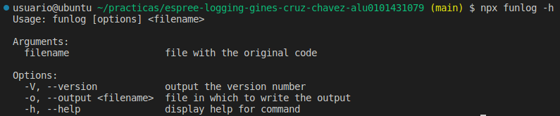
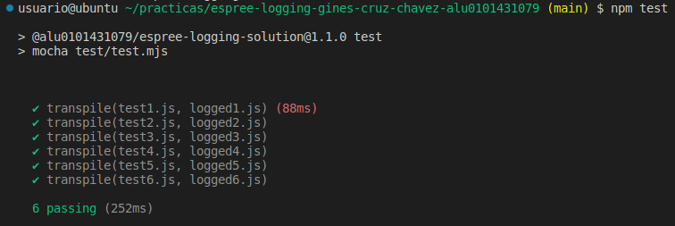
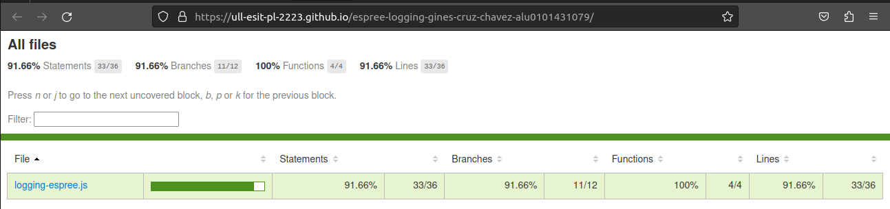
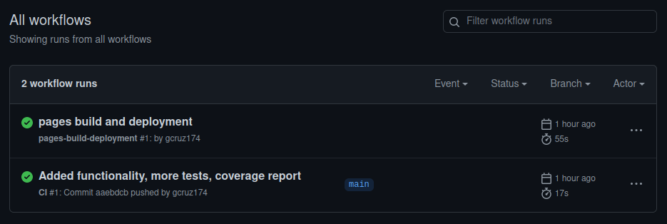
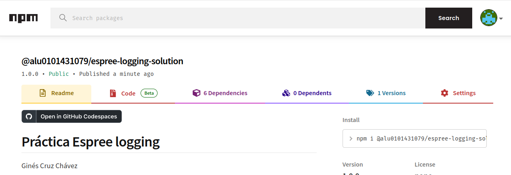

[](https://classroom.github.com/open-in-codespaces?assignment_repo_id=10325032)
# Práctica Espree logging

Ginés Cruz Chávez

## Indicar los valores de los argumentos

Se ha modificado el código de `logging-espree.js` para que el log también indique los valores de los argumentos que se pasaron a la función. 
Ejemplo:

```javascript
function foo(a, b) {
  var x = 'blah';
  var y = (function (z) {
    return z+3;
  })(2);
}
foo(1, 'wut', 3);
```

```javascript
function foo(a, b) {
    console.log(`Entering foo(${ a }, ${ b })`);
    var x = 'blah';
    var y = function (z) {
        console.log(`Entering <anonymous function>(${ z })`);
        return z + 3;
    }(2);
}
foo(1, 'wut', 3);
```

## CLI con [Commander.js](https://www.npmjs.com/package/commander)

La plantilla que se nos proporciona para la práctica viene implementada con la librería [Commander.js](https://www.npmjs.com/package/commander) para la gestión de la CLI. Esta librería nos permite definir los argumentos que se le pasan al programa, así como las opciones que se pueden pasar a la CLI. Se permite especificar el nombre del fichero de entrada, y el nombre del fichero de salida, si este último no se especifica, se imprime por pantalla la salida del programa.



## Reto 1: Soportar funciones flecha

Se ha modificado el fichero `logging-espree.js` para que el log también se añada a aquellas funciones que se declaran como 'flecha gorda'. Para ello, hay que indicarle a la función `addLogging` que también debe añadir el log a las funciones de tipo 'ArrowFunctionExpression'.

```js
/**
 * @desc Given a string of JavaScript code, return a string of JavaScript code
 * that logs the name of each function and its parameters before the
 * function is called.
 * @param {string} code JavaScript code.
 * @returns {string} JavaScript code with logging.
 */
export function addLogging(code) {
  const ast = espree.parse(code, { ecmaVersion: 6, loc: true });
  estraverse.traverse(ast, {
    enter: function(node, parent) {
      if (node.type === 'FunctionDeclaration' ||
          node.type === 'FunctionExpression' ||
          node.type === 'ArrowFunctionExpression') {
        addBeforeCode(node);
      }
    }
  });
  return escodegen.generate(ast);
}
```

## Reto 2: Añadir el número de línea

En la función `addBeforeCode`, se ha modificado para que el log también indique el número de línea en el que se encuentra la función. El parser espree ya nos proporciona la información de la línea en la que se encuentra la función, por lo que no es necesario calcularlo. Simplemente debemos habilitar esta funcionalidad especificando el parámetro `loc` en el parser.

```js
/**
 * @desc Given a function node, add a console.log statement before the
 * function that logs the name of the function and its parameters.
 * @param {object} node A function node.
 */
function addBeforeCode(node) {
  const name = node.id ? node.id.name : '<anonymous function>';
  const params = node.params.map(param => '${' +param.name + '}').join(', ');
  const beforeCode = 'console.log(\`Entering ' + name + '(' + params + ') at line ' + node.loc.start.line + '\`);';
  const beforeNodes = espree.parse(beforeCode, { ecmaVersion: 6 }).body;
  node.body.body = beforeNodes.concat(node.body.body);
}
```

## Tests y cubrimiento

Además de los 3 tests que venían proporcionados en la plantilla de esta práctica, se han añadido 3 tests más para comprobar que el programa funciona correctamente. Para ello, debemos añadirlos en el fichero `test-description.mjs` y crear los ficheros de salida correctos.

```js
export default [
  {
    input: 'test1.js',
    output: 'logged1.js',
    correctLogged: 'correct-logged1.js',
    correctOut: 'logged-out1.txt'
  },
  {
    input: 'test2.js',
    output: 'logged2.js',
    correctLogged: 'correct-logged2.js',
    correctOut: 'logged-out2.txt'
  },
  {
    input: 'test3.js',
    output: 'logged3.js',
    correctLogged: 'correct-logged3.js',
    correctOut: 'logged-out3.txt'
  },
  {
    input: 'test4.js',
    output: 'logged4.js',
    correctLogged: 'correct-logged4.js',
    correctOut: 'logged-out4.txt'
  },
  {
    input: 'test5.js',
    output: 'logged5.js',
    correctLogged: 'correct-logged5.js',
    correctOut: 'logged-out5.txt'
  },
  {
    input: 'test6.js',
    output: 'logged6.js',
    correctLogged: 'correct-logged6.js',
    correctOut: 'logged-out6.txt'
  }
]
```

Para comprobar que en los tests tanto la salida como los mensajes generados por el log son correctos, ha sido necesario añadir el siguiente fragmento de código en el fichero `test.mjs`:

```javascript
for (let i = 0; i < Test.length; i++) {
  it(`transpile(${Tst[i].input}, ${Tst[i].output})`, async () => {
    // First transpile the input file to the output file.
    await transpile(Test[i].input, Test[i].output);
    // Compare the output file with the correct output file.
    const transpileOutput = await fs.readFile(Test[i].output, 'utf8');
    const correctTranspileOutput = await fs.readFile(Test[i].correctLogged, 'utf8');
    assert.equal(removeSpaces(transpileOutput), removeSpaces(correctTranspileOutput));
    // Compare the console.log output with the correct console.log output.
    let outputs = [];
    let oldLog = console.log;
    console.log = function (...args) {
      outputs.push(args.join(' '));
    }
    // Evaluate the output file.
    await import(Test[i].output);
    // Add a blank line at the end.
    outputs.push('');
    console.log = oldLog;
    const correctOut = await fs.readFile(Test[i].correctOut, 'utf8');
    assert.equal(outputs.join('\n'), correctOut);
  });
}
```

Para obtener los mensajes impresos en pantalla por console.log, ha sido necesario reemplazar la función mediante stubbing para que los mensajes se almacenen en un array. Al final de la ejecución del test, se combina el array de mensajes en una sola cadena y se compara con la salida esperada del programa.

Los test se ejecutan con el comando `npm test` y se obtiene el siguiente resultado:



Para lograr realizar un estudio de cubrimiento de los test utilizando módulos de ES6, se ha utilizado la herramienta `c8`. Para instalarla, se ha ejecutado el siguiente comando:

```bash
npm install --save-dev c8
```

Su uso es muy similar al de la herramienta `nyc` posteriormente utilizada. Se ha definido un script en el fichero `package.json` para ejecutar los test con c8:

```json
"scripts": {
    "test": "mocha test/test.mjs",
    "cov": "c8 mocha test/test.mjs"
},
```

Para generar el informe de cubrimiento en formato HTML es necesario ejecutar el comando `npx c8 report --reporter=html`. El resultado obtenido se puede encontrar en la carpeta `docs` del repositorio y en este enlace: [coverage](https://ull-esit-pl-2223.github.io/espree-logging-gines-cruz-chavez-alu0101431079/).



## GitHub Actions

Se ha hecho uso de la integración continua de GitHub Actions de manera que por cada confirmación que se haga en el repositorio, se ejecuten los test y se compruebe que el programa funciona correctamente. Para ello, se ha creado un fichero de configuración de GitHub Actions en la carpeta `.github/workflows` con el siguiente contenido:

```yaml
# Write your workflow for CI here
name: CI

# Controls when the workflow will run
on:
  # Triggers the workflow on push or pull request events but only for the $default-branch branch
  push:
    branches: [ main ]
  pull_request:
    branches: [ main ]

  # Allows you to run this workflow manually from the Actions tab
  workflow_dispatch:

# A workflow run is made up of one or more jobs that can run sequentially or in parallel
jobs:
  # This workflow contains a single job called "build"
  build:
    # The type of runner that the job will run on
    runs-on: ubuntu-latest

    # Steps represent a sequence of tasks that will be executed as part of the job
    steps:
      # Checks-out your repository under $GITHUB_WORKSPACE, so your job can access it
      - uses: actions/checkout@v2

      # Runs a single command using the runners shell
      - name: Run tests
        run: npm ci && npm test
```

El resultado de la ejecución de los test se puede ver en la pestaña de Actions de GitHub:



## NPM

Como requisito de la práctica, se ha publicado el paquete en el registro de NPM. Para ello, primero ha sido necesario crear una cuenta en NPM y ejecutar el siguiente comando para iniciar sesión mediante la herramienta de línea de comandos:

```bash
npm login
```

Una vez iniciada la sesión, se ha publicado el paquete con acceso público con el siguiente comando:

```bash
npm publish --access=public
```

El paquete se encuentra alojado en el siguiente enlace: [npm](https://www.npmjs.com/package/@alu0101431079/espree-logging-solution).

